# 🛒 Hệ Thống Đấu Giá Trực Tuyến - Nhóm 2

Dưới đây là sơ đồ kiến trúc lớp của hệ thống:

```mermaid
classDiagram
    %% Gói common.model (Shared Data Structures)
    namespace org_example_common_model {
        class Message {
            #String sender
            #String content
            #LocalDateTime timestamp
        }
    }
    namespace org_example_common_model_user {
        class Entity {
            <<abstract>>
            #String id
            +getId() String
            +setId(String id) void
        }
        class User {
            <<abstract>>
            #String username
            #String password
            +getUsername() String
            +getPassword() String
            +displayRole()* void
        }
        class Admin {
            +banUser(User user) void
        }
        class Seller {
            +createItem() void
        }
        class Bidder {
            +placeBid() void
        }
    }
    namespace org_example_common_model_item {
        class Item {
            <<abstract>>
            #String name
            #double startingPrice
        }
        class Vehicle { -int yearOfManufacture }
        class Art { -String artistName }
        class Electronic { -int warrantyMonths }
        class ItemFactory {
            <<Factory>>
            +createItem() Item
        }
        class AuctionStatus {
            <<enumeration>>
            OPEN
            RUNNING
            FINISHED
            PAID
            CANCELED
        }
    }
    namespace org_example_common_model_chat {
        class AuctionChatMessage {
            -String auctionId
        }
    }

    %% Gói server (Backend Logic)
    namespace org_example_server_data {
        class DatabaseManager {
            -Connection connection
            +connect() void
        }
        class ItemDAO {
            -DatabaseManager db
            +save(Item item) void
        }
    }
    namespace org_example_server_manager {
        class AuctionManager {
            <<Singleton>>
            -static AuctionManager instance
            +getInstance() AuctionManager
        }
        class UserManager {
            <<Singleton>>
            -Map users
        }
        class AntiSniper {
            +checkAndExtend() void
        }
        class AutoBid {
            +executeAutoBid() void
        }
    }
    namespace org_example_server_network {
        class Subject {
            <<interface>>
            +registerObserver() void
        }
        class Observer {
            <<interface>>
            +update() void
        }
        class AuctionServer { -int port }
        class ClientHandler { -Socket socket }
        class AuctionSession { -String sessionId }
        class AuctionNotifier { -List observers }
    }

    %% Gói client (Frontend UI & Network)
    namespace org_example_client {
        class ClientApp { +start() void }
        class Launcher { +main() void }
    }
    namespace org_example_client_network {
        class NetworkClient {
            <<Singleton>>
            -Socket socket
        }
    }
    namespace org_example_client_controllers {
        class LoginController { +handleLogin() void }
        class HomeController { +handleJoinAuction() void }
        class SignUpController {}
        class AccountViewController {}
        class MyItemsController {}
        class WatchlistController {}
        class SalesHistoryController {}
        class RoleSelectionController {}
        class AddItemDialog {}
        class AddItemViewController {}
        class BidDialog {}
        class BidHistoryController {}
        class BidObserver { <<interface>> }
    }
    namespace org_example_client_controllers_admin {
        class AdminChildController { <<interface>> }
        class AdminDashboardController {}
        class AdminAuctionsController {}
        class AdminItemsController {}
        class AdminOverviewController {}
        class AdminStatsController {}
        class AdminUsersController {}
    }

    %% Mối quan hệ giữa các lớp
    User --|> Entity
    Item --|> Entity
    Admin --|> User
    Seller --|> User
    Bidder --|> User
    Vehicle --|> Item
    Art --|> Item
    Electronic --|> Item
    AuctionChatMessage --|> Message
    AuctionNotifier ..|> Subject
    ClientHandler ..|> Observer
    AdminDashboardController o-- AdminChildController
    ItemDAO o-- DatabaseManager
    
    NetworkClient ..> ClientHandler : Socket Connection
    LoginController ..> NetworkClient
    HomeController o-- NetworkClient
```

### 🎯 Minh chứng Kiến trúc & Thiết kế Hệ thống (Nhóm 2)

[cite_start]Để đáp ứng xuất sắc các tiêu chí đánh giá trong barem điểm Bài tập lớn:

1. **Mô hình Kiến trúc MVC & Pattern DAO:**
   - [cite_start]**Model:** Toàn bộ các thực thể nghiệp vụ dữ liệu (`User`, `Item`, `Message`) được cô lập hoàn toàn trong package `common.model` giúp dễ dàng đồng bộ tuần tự hóa (`Serialization`) qua luồng mạng.
   - [cite_start]**View & Controller:** Phân rã cực kỳ mạch lạc trong các package `client.controllers` và `client.controllers.admin` xử lý giao diện JavaFX độc lập theo nguyên lý Single Responsibility.
   - [cite_start]**DAO (Data Access Object):** Module `ItemDAO` kết hợp với `DatabaseManager` đảm nhận việc tách biệt hoàn chỉnh tầng lưu trữ (Database) khỏi logic nghiệp vụ của Server.

2. **Kiến trúc Client-Server & Xử lý đồng thời (Concurrency):**
   - [cite_start]Hệ thống vận hành theo mô hình mạng **Client-Server qua Socket** sử dụng luồng kết nối tập trung `NetworkClient` ở Client và `AuctionServer` ở Server.
   - [cite_start]Quá trình đa luồng xử lý đồng thời (`Concurrency`) được hiện thực thông qua các luồng `ClientHandler` chạy song song nhằm giải quyết bài toán chống tranh chấp dữ liệu (`Race Condition`) khi nhiều người dùng cùng đặt giá đấu tại một thời điểm.

3. **Áp dụng các Design Patterns cốt lõi:**
   - [cite_start]**Singleton Pattern:** Áp dụng nghiêm ngặt tại các bộ điều phối trung tâm bao gồm `AuctionManager`, `UserManager` (Server) và đầu mối mạng `NetworkClient` (Client).
   - [cite_start]**Factory Method Pattern:** Sử dụng lớp `ItemFactory` nhằm khởi tạo đa hình một cách linh hoạt cho các chủng loại sản phẩm khác nhau (`Vehicle`, `Art`, `Electronic`).
   - [cite_start]**Observer Pattern (Realtime Update):** Triển khai cặp giao diện `Subject` / `Observer` phối hợp với `AuctionNotifier` ở Backend, kết hợp với `BidObserver` ở Frontend giúp cập nhật biến động giá và tin nhắn phòng chat tức thời (Realtime) tới toàn bộ các Client đang tham gia.

4. **Tính năng nâng cao đạt điểm thưởng tối đa:**
   - [cite_start]**Auto-Bidding:** Tích hợp module `AutoBid` hỗ trợ tự động hóa tiến trình nâng giá thông minh dựa trên cấu hình biên độ tối đa của người đấu giá.
   - [cite_start]**Anti-sniping:** Thành phần `AntiSniper` theo dõi sát sao thời gian thực để thực hiện gia hạn phiên tự động nếu phát hiện hành vi đặt giá ở những giây cuối cùng.
